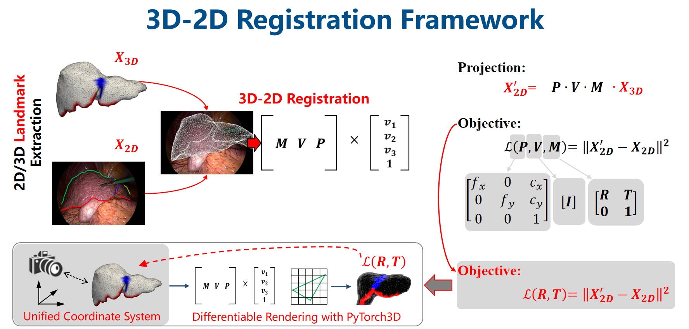

# PyTorch3D-based 3D-2D Rigid Registration for Laparoscopic Liver Navigation

This repository implements a differentiable 3D–2D rigid registration pipeline using [PyTorch3D](https://pytorch3d.org/), tailored for anatomical landmarks extracted from preoperative 3D liver meshes and intraoperative laparoscopic images. This framework supports the downstream application of augmented reality (AR) overlay in liver surgery by aligning 3D surface models with laparoscopic video frames based on anatomical cues.

---

## 📌 Overview

<p align="center">
  
</p>

As shown in the figure above, the framework consists of the following key steps:

- **Landmark Extraction**: 3D landmarks (e.g., falciform ligament and liver ridge) are extracted from liver mesh surfaces using segmentation models. 2D landmarks are annotated or detected from laparoscopic video frames.
- **Differentiable Rendering**: Using the PyTorch3D renderer, the 3D landmarks are projected to 2D space based on camera intrinsics and pose parameters (rotation + translation).
- **Optimization**: The camera pose is optimized by minimizing the reprojection error between the projected 3D landmarks and the ground-truth 2D landmarks.

The projection follows the formulation:
\[
X_{2D}' = P \cdot V \cdot M \cdot X_{3D}
\]
where \(P\), \(V\), and \(M\) denote the projection, view, and model matrices respectively.

---

## 🧭 Running the Registration

The main pipeline can be executed by running:

```bash
python run_p2ilf_7.py
```

This script performs rigid registration between 3D liver meshes and 2D laparoscopic landmarks.

---

## 📁 Required Inputs

- `obj/`: Preoperative 3D liver mesh models in `.obj` format  
  _Example_: `obj/3Dircadb-10.obj`
  
- `image-2d-landmrk/`: JSON or TXT files containing 2D anatomical landmarks from laparoscopic keyframes

- `camera-parameter/`: JSON or TXT files specifying laparoscope intrinsic parameters (`fx`, `fy`, `cx`, `cy`)

---

## 📂 Directory Structure

PyTorch3D-3D-2D-Registration/ │ ├── obj/ # 3D mesh models (.obj) ├── image-2d-landmrk/ # 2D landmark annotations ├── camera-parameter/ # Camera intrinsics ├── run_p2ilf_7.py # Main registration script ├── RegistrationFramework.png # Overview figure └── Introduction.md # This file

---

## 🧪 Sample Data and Source

We include one reference liver mesh model for demonstration:

- `obj/3Dircadb-10.obj` (from the public 3Dircadb dataset)

For full data used in this paper, including paired 2D/3D landmarks and camera parameters, please refer to the [P2ILF Challenge repository](https://github.com/sharib-vision/P2ILF/tree/main).
