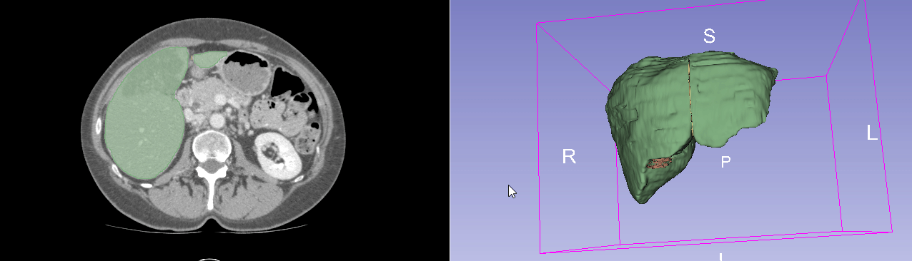

# MeshGraphCNN

The three folders "Obj", "Seg" and "Sseg" represent the Mesh mesh of the liver and the labels of the corresponding edges, and the soft labels, respectively. The other "TSMCN-main.zip" is the code for the TSMCN model.


<sup>Here we use a CT image from [the 3Dircadb database] (https://www.ircad.fr/research/data-sets/liver-segmentation-3d-ircadb-01/) as an example to show how the area of the falciform ligament can be annotated from a CT image. Specifically, the falciform ligament divides the liver into left and right lobes. Therefore, the initial annotation starting point can be found from the CT image. Since the ligament will extend to the abdominal cavity, slide sections from the CT image until the ligament area can be seen at the abdominal cavity junction is noted. **Note that** the annotations in the above CT images indicate the location of the falciform ligament, but destroy the liver surface mesh. Therefore, our liver-based label re-exports an unmanipulated mesh of the liver surface. Then, based on the above position as a reference, **MeshLab** and **Blender** software were used to annotate the mesh edges where ligaments were located on the new liver surface network.</sup>

### Paper

Nested Resolution Mesh-Graph CNN for Automated Extraction of Liver Surface Anatomical Landmarks

### Installation

Refer to the official PyTorch version of "MeshCNN". (https://bit.ly/meshcnn) [[Project Page]](https://ranahanocka.github.io/MeshCNN/)<br>

### Landmark Segmentation
You need to set up the training set, test set, and verification set subfolders under the liver-mesh path. In other words, split the original obj folder.

Training and testing
```bash
python train.py
python test.py
```

# Questions / Issues
Note that the code has not been carefully curated. We will carefully collate and republish the submitted papers after the final results are available.

# Acknowledgments
This code design was adopted from [MeshCNN](https://github.com/ranahanocka/MeshCNN).
