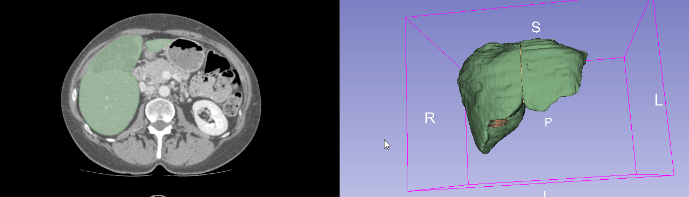

# Nested Resolution Mesh-Graph CNN for Liver Landmark Segmentation

This repository provides the implementation and dataset used in our study:

> **Nested Resolution Mesh-Graph CNN for Automated Extraction of Liver Surface Anatomical Landmarks**  

We describe a mesh-based deep learning framework for automatically segmenting anatomical landmarks—specifically the **falciform ligament** and **liver ridge**—on 3D liver meshes. The model combines global geometric learning and local anatomical refinement using dynamic graph convolution (DGCNN) and mesh convolution (MeshConv), aiming to support downstream applications such as **AR-assisted surgical navigation**.

---

## 🔍 Highlights

- ⚙️ A novel nested resolution Mesh-Graph CNN is proposed for the segmentation of liver surface anatomical landmarks.
- 🧠 Seamlessly integrated global shape analysis with local topological refinement is proposed to enhance segmentation accuracy.
- 🏷️ An attention fusion module with auxiliary supervision adaptively combines multi-threshold landmark proposals, enhancing spatial consistency and anatomical plausibility.
- 📊 200 liver meshes are annotated that are used to both develop and validate our methods.
- ⚙️ Experiments demonstrate superior performance of our method over state-of-the-art in both internal and external datasets.

---

## 📁 Repository Structure

```bash
MeshGraphCNN/
├── datasets/
│   └── All_data/
│       ├── livermesh/                # Liver mesh files (.obj)
│       ├── seg/                      # Edge-wise landmark labels: 1=background, 2=ligament, 3=ridge
│       ├── sseg/                     # Soft labels (optional)
│       ├── edges/                    # Mesh edge list per file
│       ├── classes.txt               # Label definitions
│       ├── mean_std_cache.p          # MeshCNN normalization cache
│       └── 3DMeshAnnotationTutorial/
│           ├── LabelLandmarks-Blender.py
│           └── annotating-edges-on-a-3D-liver-mesh.pdf
├── PyTorch3D-3D-2D-Registration/
│   ├── run_p2ilf_7.py                # PyTorch3D-based 3D-2D registration demo
│   ├── obj/                          # Liver mesh for registration
│   ├── camera-parameter/            # Camera intrinsics
│   ├── image-2d-landmark/           # 2D laparoscopic landmark inputs
│   └── RegistrationFramework.png    # Framework overview figure
├── train.py
├── test.py
└── ...
```

## 🧪 Getting Started

### 🔧 Installation

This implementation builds on [MeshCNN](https://github.com/ranahanocka/MeshCNN).  
Please refer to its [installation guide](https://bit.ly/meshcnn) to configure your environment.


### 🏁 Training and Testing

Ensure your training/validation/test split is prepared under `livermesh/`:

```bash
python train.py
python test.py
```


## 📦 Dataset and Annotation Protocol

We provide a curated dataset of **200 liver mesh samples**, manually annotated with edge-level anatomical landmarks.  
The meshes were reconstructed from three public CT datasets: **3Dircadb**, **MSD8**, and **AMOS**.

Each mesh annotation labels:
- **Background** (class 1)
- **Falciform Ligament** (class 2)
- **Liver Ridge** (class 3)

All annotation procedures reference anatomical positions visible in CT views, ensuring spatial consistency.

### ✏️ Annotation Workflow

- 📍 Initial localization of the falciform ligament based on CT slice inspection.
- 🛠 Manual annotation conducted in **3D Slicer** and **Blender** software.
- 🧩 Edge-level tagging performed using the provided script [`LabelLandmarks-Blender.py`](datasets/All_data/3DMeshAnnotationTutorial/LabelLandmarks-Blender.py).

📄 Full annotation guide:  
[`annotating-edges-on-a-3D-liver-mesh.pdf`](datasets/All_data/3DMeshAnnotationTutorial/annotating-edges-on-a-3D-liver-mesh.pdf)

<details>
<summary>CT-Guided Labeling Illustration</summary>



<sup>Example showing how CT slice observations guide the landmark labeling process on 3D liver meshes.</sup>

</details>

---

## 🧮 PyTorch3D-Based 3D–2D Registration Demo

We additionally provide a lightweight implementation for rigid **3D–2D registration** using **PyTorch3D**'s differentiable rendering framework.

- 🗂 Code entry point: [`run_p2ilf_7.py`](PyTorch3D-3D-2D-Registration/run_p2ilf_7.py)
- 📥 Inputs required:
  - Liver mesh: `obj/`
  - 2D laparoscopic landmarks: `image-2d-landmark/`
  - Camera intrinsics: `camera-parameter/`
- 🧪 Included example: `3Dircadb-10.obj` (for demonstration)

📚 To fully replicate experiments, real laparoscopic data and keyframes from the [P2ILF Challenge](https://github.com/sharib-vision/P2ILF/tree/main) are needed.

<details>
<summary>Registration Framework</summary>


<sup>Framework illustrating 3D mesh to 2D keyframe registration using differentiable rendering.</sup>

</details>

## 🙏 Acknowledgments

This project builds upon several excellent open-source works and datasets.  
We sincerely acknowledge the following contributions:

- [MeshCNN](https://github.com/ranahanocka/MeshCNN) — for providing the foundation of mesh convolutional networks.
- [DGCNN](https://github.com/Luhuanz/pytorch_project/tree/7296ea40df088fdeb2e192d71cbc373507156d97/Deep_project/dgcnn) — for dynamic graph learning methods utilized in our coarse segmentation stage.
- [PyTorch3D](https://pytorch3d.org/) — for the differentiable rendering framework enabling our 3D–2D registration experiments.
- [P2ILF Challenge](https://github.com/sharib-vision/P2ILF/) — for supplying valuable benchmark datasets and clinical evaluation protocols.

We deeply appreciate the efforts of these communities, which made this research possible.

